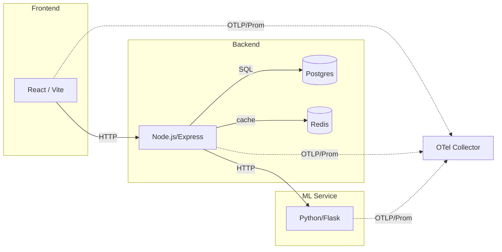

# 🛒 ShopMicro: Platform Engineering Capstone

## 1. Problem Statement & Architecture Summary

ShopMicro is a microservices-based e-commerce platform. The engineering objective of this repository is to deliver a production-grade, reproducible, observable, and secure infrastructure platform. This project implements a complete Platform Engineering toolchain, migrating the application from local development scripts to a fully automated, resilient Kubernetes environment on AWS.

**Core Components:**

* **Frontend:** React + Vite
* **Backend:** Node.js + Express (Product API)
* **ML-Service:** Python + Flask (Recommendation Engine)
* **Data Layer:** PostgreSQL (Persistent) + Redis (Cache)

## 2. High-Level Architecture Diagram



## 3. Prerequisites & Tooling

To provision and deploy this environment, the following tools must be installed locally or available in the CI runner:

| Tool | Version | Purpose |
| --- | --- | --- |
| **Docker / Compose** | 24.0+ | Local container orchestration & image building |
| **Kubernetes (kubectl)** | 1.28+ | Cluster interaction and manifest application |
| **Terraform** | 1.7.0+ | Infrastructure as Code (AWS Provisioning) |
| **Ansible** | 2.15+ | Configuration Management (GitHub Runners, Host prep) |
| **Go** | 1.21+ | Custom DevOps CLI execution |

## 4. Exact Deploy Commands

### Local Development (Docker Compose)

Brings up the infrastructure and application in a local sandbox.

```bash
# 1. Bring up data and observability infrastructure
docker compose up -d postgres redis

# 2. Start backend API
cd backend && npm ci && npm start &

# 3. Start ML-Service
cd ../ml-service && pip install -r requirements.txt && python app.py &

# 4. Start Frontend
cd ../frontend && npm ci && npm run dev

```

### Production / Staging (Kubernetes)

Assuming your `KUBECONFIG` is pointing to the provisioned cluster:

```bash
# Apply the entire stack including namespace, deployments, and observability
kubectl apply -k k8s/

```

*Access the application via the configured Ingress endpoint.*

## 5. Testing & Verification Commands

```bash
# Backend Unit Tests
cd backend && npm test

# ML-Service Tests
cd ml-service && pytest

# Infrastructure Policy-as-Code & Validation
cd infra && terraform validate && tflint && checkov -d .

# DevOps Automation Utility (Environment Health Check)
cd devops_tool/healthcheck && go run main.go --env=prod

```

---

## 6. Observability Usage Guide

ShopMicro is fully instrumented using OpenTelemetry, pushing metrics, logs, and traces to a centralized Grafana stack.

**Accessing Dashboards:**

1. Port-forward the Grafana service: `kubectl port-forward svc/grafana 3000:3000 -n shopmicro`,
then on your local machine run `ssh -i ~/.ssh/terraform-key-pair.pem -L 3030:localhost:3000 ubuntu@master_ip`
2. Access `http://localhost:3030` (Default credentials in K8s Secret).
3. Navigate to **Dashboards** to view:
* **Platform Overview:** Node CPU/Memory, Pod counts, Network I/O.
* **Backend/Service Health:** RED (Rate, Errors, Duration) metrics.
* **Trace Correlation:** Tempo waterfalls linked to Loki application logs.


**Service Level Objectives (SLOs) & Alerts:**

* **Availability:** 99.5% success rate on all API requests.
* *Alert:* `BackendHighErrorRate` triggers if 5xx errors exceed 5% for 5 minutes.


* **Latency:** 90% of requests must complete under 200ms.
* *Alert:* `BackendLatencyDegradation` triggers if p90 > 200ms for 10 minutes.


---

## 7. Rollback Procedure

In the event of a failed deployment or an active SLO breach, execute the following to restore service stability:

**Kubernetes Deployment Revert:**

```bash
# Identify previous revision history
kubectl rollout history deployment/backend -n shopmicro

# Instantly rollback to the previous stable state
kubectl rollout undo deployment/backend -n shopmicro

```

**Infrastructure (Terraform) Revert:**

1. Revert the offending Pull Request in GitHub.
2. The CI/CD pipeline will automatically run `terraform apply -var="admin_ip=admin_ip/32"` against the previous known-good state. where admin_ip is the machine you want to manage your terraform and ansible ssh from, you can check this by `curl ifconfig.me`

---

## 8. Security Controls Implemented

* **Least-Privilege Network Paths:** Kubernetes NetworkPolicies restrict cross-pod communication (e.g., only the Backend can talk to Postgres; Frontend cannot bypass the API).
* **Secrets Management:** No plaintext secrets in Git. Secrets are injected via GitHub Actions and mounted securely as Kubernetes Secrets.
* **Infrastructure Access:** No public SSH exposure. Cluster access is strictly authenticated via IAM roles (AWS) or standard RBAC (`kubeconfig`).
* **Shift-Left Security:** CI/CD pipeline enforces `Checkov` to block insecure Terraform configurations (e.g., unencrypted volumes) before merging.

---

## 9. Backup & Restore Procedure

**PostgreSQL (Stateful Data)**

* **Automated:** AWS Lifecycle Manager takes daily EBS snapshots of the underlying Postgres Persistent Volume (30-day retention).
* **Manual SQL Dump:**
```bash
POD_NAME=$(kubectl get pods -l app=postgres -n shopmicro -o jsonpath='{.items[0].metadata.name}')
kubectl exec $POD_NAME -n shopmicro -- pg_dump -U postgres shopmicro > backup.sql

```


* **Restore:** Copy the `.sql` file into the pod and execute `psql -f /tmp/backup.sql` or recreate the PVC from the latest AWS snapshot.

**Redis (Cache)**

* Data is strictly ephemeral. Pod recreation results in an empty cache, which the application gracefully handles via cache-miss lookups to PostgreSQL.

---

## 10. Known Limitations & Next Improvements

1. **Frontend Observability:** The React frontend currently lacks Real User Monitoring (RUM). Next iteration will implement the OpenTelemetry Web SDK to propagate trace contexts from the browser to the backend.
2. **State Management:** Tempo and Loki are currently utilizing `emptyDir` for storage, meaning historical traces/logs are lost on node restarts. Next phase will attach dedicated S3 buckets for long-term telemetry retention.
3. **Deployment Strategy:** Standard rolling updates are currently used. Transitioning to Argo Rollouts for automated canary deployments tied directly to the Prometheus SLOs is planned.
